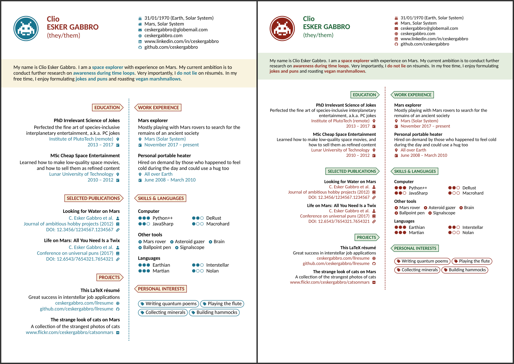

# Lean Two Column CV

A [Craftadoc](https://craftadoc.com) template. (Using LaTeX.)

Easily create a beautiful CV by using the Lean Two Column CV template. This CV starts with a beautiful header, with a big name, profile image and personal information. The list of personal info items is customizable, allowing you to choose any font-awesome icon, and allows for embedded links. Useful in case you are sending your CV electronically. Then follows a highlighted short introduction, featuring a yellow background, and blue bold emphasis. (You can specify emphasis by using the `\emph{your_text_here}` command, directly inside the text block input.)

The main CV content is split into two columns. Every section starts with a title tag pointing to the dotted line in the middle. The sections provided by default are *education*, *publications*, *projects*, *work experience*, *skills*, and *personal interests*, each allowing you to enter information in the same way as shown in the preview. These provided sections will not be shown when left empty. Want to add more sections? That's possible with the final *extra sections* input. Add as many sections as you want, but you are limited to the generic input, which looks like the items in the *publications* section. Happy writing!

### How do I use this?

#### Option 1:

Directly use the template in your browser using Craftadoc [here!](https://app.craftadoc.com/template/overview/6380cb9e5f176a981d47ffab) And fill in the template using the automatically generated UI. This is the easiest option.

#### Option 2:

Open the source code in Overleaf: visit [the template page](https://app.craftadoc.com/template/overview/6380cb9e5f176a981d47ffab), select the gear icon in the top right and select `Open in Overleaf`.

#### Option 3:

Clone this repository and use your favorite latex compiler locally. (This template uses XeLatex.)

## Example:

The left-hand side image is the default look, while the right-hand side image is the look with the
`compact` class option and some alternative colors. The corresponding PDF files
are inside the [showcase](./showcase) folder.

## Source:
https://github.com/cdelledonne/llresume

## Original readme:

# Lean LaTeX Résumé

This project provides a LaTeX class `llresume.cls` to easily write lean résumés
using your favorite typesetting language.

## Usage

You can edit and compile the résumé on [Overleaf][overleaf] or clone this
repository and compile it yourself. Look into [main.tex](./main.tex) for a
comprehensive example and for how to use this class.

## Showcase

The two images below showcase the look of `llresume`. The left-hand side image
is the default look, while the right-hand side image is the look with the
`compact` class option and some alternative colors. The corresponding PDF files
are inside the [showcase](./showcase) folder.

[overleaf]: https://www.overleaf.com/latex/templates/lean-latex-resume/sjbtgfrzjkdw
